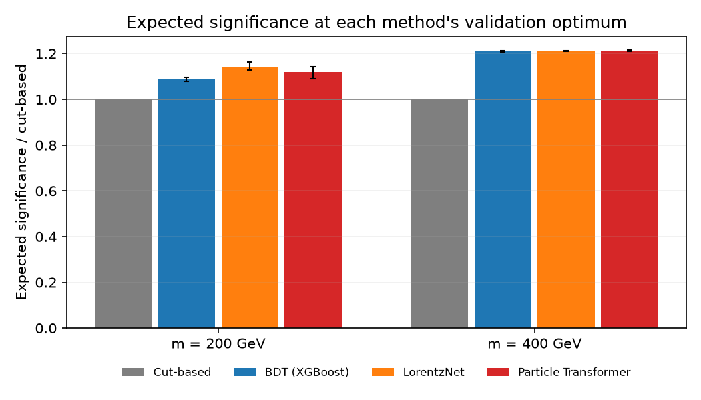
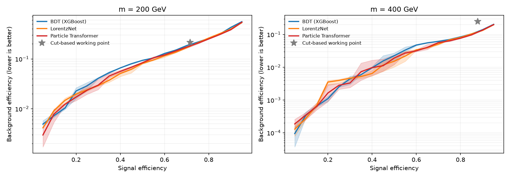
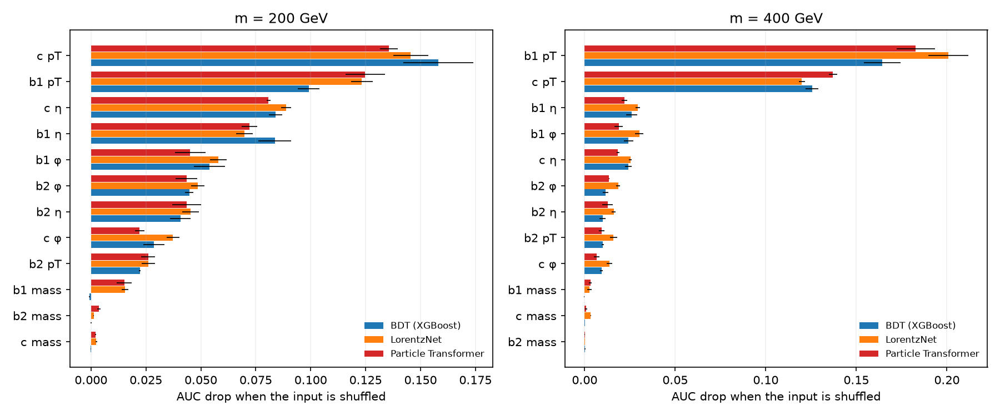
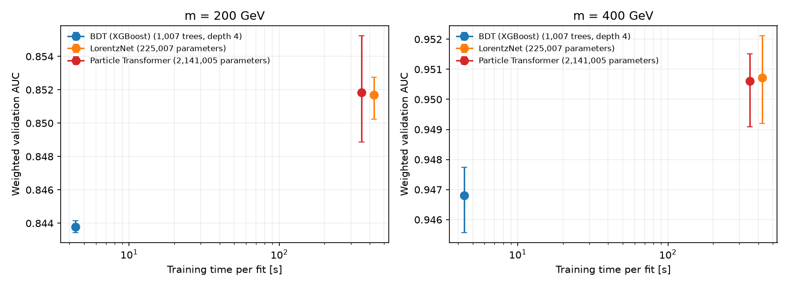

# bsm-higgs-ml-benchmark

An end-to-end machine-learning pipeline for a rare-signal classification problem on particle-collision
simulation, and a controlled benchmark of three model families against a hand-tuned cut-based baseline:
gradient-boosted trees (XGBoost), a symmetry-aware graph network (LorentzNet) and a transformer (Particle
Transformer). The emphasis is on **evaluation**: fixed data splits, decisions made on validation data
only, multiple training seeds, paired statistical comparisons, cost and interpretability.

The physics use case extends the study published in
[arXiv:2511.19604](https://arxiv.org/abs/2511.19604). Simulated data, production details and
research-level results are not part of this repository.

## Results at a glance



| Method | Significance vs cut-based, m = 200 GeV | AUC, m = 200 GeV | Significance vs cut-based, m = 400 GeV | AUC, m = 400 GeV |
| --- | --- | --- | --- | --- |
| Cut-based selection | 1.00 (reference) | - | 1.00 (reference) | - |
| BDT (XGBoost) | 1.09 (1.08-1.10) | 0.844 | 1.21 (1.21-1.21) | 0.947 |
| LorentzNet | **1.14** (1.13-1.16) | **0.852** | 1.21 (1.21-1.21) | **0.951** |
| Particle Transformer | 1.12 (1.09-1.14) | **0.852** | 1.21 (1.21-1.21) | **0.951** |

The two columns are two benchmark hypotheses for the mass m of the new particle. The
ranges are the spread over three training seeds. Everything is measured on held-out validation data;
the test split is kept for a single final evaluation. Full tables and figures: [benchmark/](benchmark/README.md).

- **Machine learning beats the cut-based selection** by 9-21% in expected significance.
- **Both neural networks beat the BDT's ranking quality** (AUC +0.008 at m = 200 GeV, +0.004 at m = 400 GeV;
  95% paired-bootstrap intervals exclude zero, every seed agrees) and tie with each other.
- **At m = 400 GeV all three learned models give the same significance.** The operating point there is
  limited by how many simulated background events are available, not by the classifier: a better
  ranking metric does not always move the task metric (see [Trade-offs and lessons](#trade-offs-and-lessons)).
- **LorentzNet matches the transformer with a tenth of its parameters** and 2.6x faster inference.

## The problem in plain terms

Particle colliders record billions of collisions. A hypothetical new particle would appear as a tiny
excess of events with a specific signature, here three **jets** (collimated sprays of particles), two
**tagged** as coming from bottom quarks and one from a charm quark. Ordinary processes produce the
same signature about a thousand times more often. Each simulated event carries a **weight** (how many
real events it stands for), so the task is weighted binary classification under extreme class
imbalance. The figure of merit is the **expected significance** of the excess after a selection,
`Z = sqrt(2((S+B) ln(1+S/B) - S))` for expected signal S and background B, which rewards removing
background while keeping signal. It is reported relative to the baseline, without systematic
uncertainties.

## Methods compared

| Method | Input | Notes |
| --- | --- | --- |
| Cut-based selection | Invariant mass window and activity cuts | Candidate cuts chosen on validation data |
| BDT (XGBoost) | 15 engineered features of the three jets | Masses, angular separations, momenta |
| LorentzNet | Four-momenta of the three jets | Graph network built on Lorentz-invariant pairwise products ([Gong et al., 2022](https://arxiv.org/abs/2201.08187)) |
| Particle Transformer | The three jets as tokens | Attention with pairwise-feature bias; upstream implementation, weaver-core 0.4.17 ([Qu et al., 2022](https://arxiv.org/abs/2202.03772)) |
| Deep Sets (control) | Same as LorentzNet | Per-jet network with no pairwise terms: isolates the value of relational structure |

All models see the same events, splits and training weights. Networks use their published
configurations without tuning, the same optimizer and schedule, and the same checkpoint rule.

## Results



**Ranking quality.** Paired AUC differences, three seeds, 95% bootstrap interval:

| Comparison | m = 200 GeV | m = 400 GeV |
| --- | --- | --- |
| LorentzNet vs BDT | +0.0079 [+0.0024, +0.0137] | +0.0039 [+0.0005, +0.0087] |
| Particle Transformer vs BDT | +0.0081 [+0.0027, +0.0137] | +0.0038 [+0.0011, +0.0073] |
| Particle Transformer vs LorentzNet | +0.0001 [-0.0041, +0.0038] | -0.0001 [-0.0031, +0.0025] |
| Deep Sets (control) vs BDT | -0.0237 [-0.0326, -0.0119] | -0.0096 [-0.0162, -0.0023] |

The control without pairwise terms is *worse* than the BDT: the networks' gain comes from modelling
relations between jets, which the BDT only sees through hand-built features.

**What the models use.** Shuffling one raw input at a time (permutation importance) shows all three
models rely on the same quantities: the jets' transverse momenta first, then their directions.



## Trade-offs and lessons



| Model | Size | Training time per fit | Inference per 1k events |
| --- | --- | --- | --- |
| BDT (XGBoost) | 1,007 trees, depth 4 | 4 s (CPU) | 0.8 ms (CPU) |
| LorentzNet | 225,007 parameters | 7 min (GPU) | 1.8 ms (GPU) |
| Particle Transformer | 2,141,005 parameters | 6 min (GPU) | 4.8 ms (GPU) |

- **Inductive bias beats scale here.** On three input objects, the symmetry-aware LorentzNet reaches
  the transformer's accuracy with 10x fewer parameters. More capacity needs more information (more
  objects per event), not a bigger model on the same inputs.
- **The BDT is the cost-efficient default.** It trains in seconds on a CPU and gives most of the gain
  over the cuts; the networks add a small, statistically robust improvement at 100x the training cost.
- **A metric can saturate on the data, not the model.** The expected significance needs an operating
  point supported by enough simulated background (at least 100 effective events). At m = 400 GeV
  that floor, not the classifier, sets the result, so the AUC gain does not reach the task metric.
  The remedy is more simulation, not a better model.
- **One training run is not a measurement.** Training seeds of the same model differ by up to 0.006
  AUC, the size of the effect being measured; every comparison therefore pairs models on
  the same events and seeds and uses a bootstrap interval.
- **Weighted data changes the sample size.** Event weights span orders of magnitude, so the effective
  number of events (`(sum w)^2 / sum w^2`) is far below the row count; it drives both the operating
  points and the uncertainty.

## How the evaluation works

See [docs/EVALUATION.md](docs/EVALUATION.md). In short:

1. **Fixed, event-level splits** (80/10/10) from a deterministic hash, identical for every model.
2. **Validation decides everything**: early stopping, checkpoints and operating points. The test
   split is untouched until one final evaluation.
3. **Decision rules written down before training**, including what counts as an improvement.
4. **Paired comparisons** on the same events and seeds, with a bootstrap over validation events.
5. **Contract checks in every report**: reloaded models reproduce their saved scores, rebuilt features
   reproduce the model inputs, and each report re-verifies its input and source hashes before
   finishing.

## Engineering

- **Data extraction** ([compactor/](compactor/README.md)): a standalone, dependency-light package that
  streams large simulation files into typed Parquet with bounded memory, resumable chunks and a hash
  of every input. It runs on a CPU server without any ML libraries.
- **Layered architecture** ([docs/ARCHITECTURE.md](docs/ARCHITECTURE.md)): `domain` (rules and
  metrics), `application` (use cases), `adapters` (I/O, XGBoost, PyTorch, reports), `commands` (CLI),
  with import boundaries enforced by a test.
- **Reproducible reports**: every study freezes its settings, archives its source code and hashes its
  inputs and outputs; notebooks only display saved artifacts.
- **Tests**: about 240 tests. They include end-to-end runs on synthetic data: extraction, training,
  inference and the tagging closure. Continuous integration runs them on Linux with Python 3.11.

## Repository layout

```text
compactor/          standalone extraction package (simulation files -> Parquet)
src/hepml/          pipeline: domain, application, adapters, commands
studies/cg_bbc/     simplified example configuration of the analysis (features, selections, study designs)
notebooks/          report templates; they read saved artifacts only
scripts/            packaging of the extraction for the server that stores the simulation files
benchmark/          the benchmark figures and tables shown above
tests/              unit and end-to-end tests on synthetic data
docs/               architecture and evaluation notes
```

## Getting started

```bash
python -m pip install -e ./compactor -e ".[dev,research]"
python -m ruff check src tests studies scripts compactor
python -m pytest -q
```

The networks need PyTorch (the `networks` extra) and, for the transformer, the upstream model:
`pip install --no-deps weaver-core==0.4.17`. The tests skip them when absent. No data is included,
so the studies themselves cannot be rerun from this repository; the tests exercise every stage on
synthetic inputs.

## References

- C. Fang, W.-S. Hou, C. Kao, M. Krab, *Enhanced Charged Higgs Signal at the LHC*,
  [arXiv:2511.19604](https://arxiv.org/abs/2511.19604).
- S. Gong et al., *An efficient Lorentz equivariant graph neural network for jet tagging*, JHEP 07
  (2022) 030. LorentzNet is re-implemented here.
- H. Qu, C. Li, S. Qian, *Particle Transformer for Jet Tagging*, ICML 2022. Used through
  [weaver-core](https://github.com/hqucms/weaver-core) (MIT License).
- XGBoost, SHAP, PyTorch, uproot and awkward-array.

## License

MIT; see [LICENSE](LICENSE).
