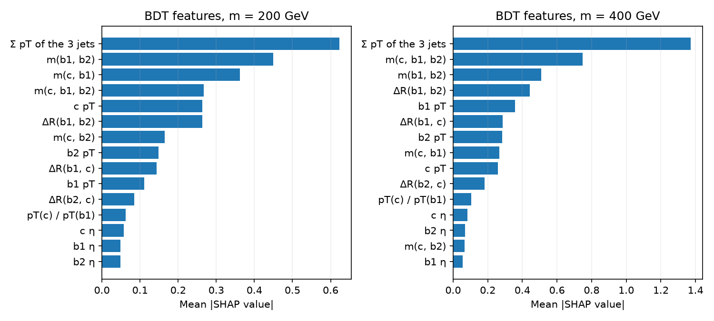

# Benchmark: cut-based selection, BDT, LorentzNet and Particle Transformer

Two benchmark hypotheses (a new particle of mass m = 200 GeV and m = 400 GeV), validation data,
three training seeds per model. Significances are expected, statistics-only and relative to the
cut-based selection; see [the methodology](../docs/EVALUATION.md). The test split is not used.

| Method | m = 200 GeV: significance vs cut-based | AUC | m = 400 GeV: significance vs cut-based | AUC |
| --- | --- | --- | --- | --- |
| Cut-based | 1.00 (reference) | - | 1.00 (reference) | - |
| BDT (XGBoost) | 1.09 (1.08-1.10) | 0.8438 | 1.21 (1.21-1.21) | 0.9468 |
| LorentzNet | 1.14 (1.13-1.16) | 0.8517 | 1.21 (1.21-1.21) | 0.9507 |
| Particle Transformer | 1.12 (1.09-1.14) | 0.8518 | 1.21 (1.21-1.21) | 0.9506 |

| Paired AUC difference (3 seeds, 95% bootstrap interval) | m = 200 GeV | m = 400 GeV |
| --- | --- | --- |
| LorentzNet vs BDT | +0.0079 [+0.0024, +0.0137] | +0.0039 [+0.0005, +0.0087] |
| Particle Transformer vs BDT | +0.0081 [+0.0027, +0.0137] | +0.0038 [+0.0011, +0.0073] |
| Particle Transformer vs LorentzNet | +0.0001 [-0.0041, +0.0038] | -0.0001 [-0.0031, +0.0025] |

| Model | Size | Training time per fit | Inference per 1k events |
| --- | --- | --- | --- |
| BDT (XGBoost) | 1,007 trees, depth 4 | 4 s (cpu) | 0.8 ms (cpu) |
| LorentzNet | 225,007 parameters | 426 s (cuda) | 1.8 ms (cuda) |
| Particle Transformer | 2,141,005 parameters | 352 s (cuda) | 4.8 ms (cuda) |

The inference times include building each model's inputs from the stored jets; the BDT runs on a
CPU, the networks on one consumer GPU (RTX 5080).

## Figures

**Expected significance relative to the cut-based selection**, at each method's validation optimum:

**ROC curves** (physically weighted; band: seed range) with the cut-based working point:

**Permutation importance** of the twelve raw inputs shared by all models:

**SHAP values** of the BDT's engineered features:

**Accuracy against training cost** (error bars: seed range):

## Tables

`tables/` holds the numbers behind the figures: `methods.csv` (relative significance, AUC and operating
point per method and seed), `paired_auc.csv` (paired comparisons with bootstrap intervals),
`permutation.csv`, `shap.csv`, `roc.csv` and `costs.csv`. They were produced by
`hepml benchmark-report` (`src/hepml/commands/benchmark_report.py`) from the saved models and scores.
