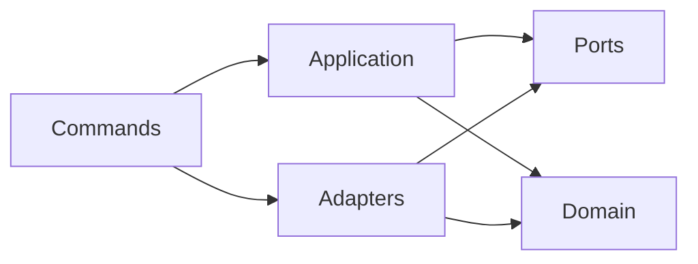

# Architecture

Four shallow layers and one ports module, plus an independent extraction package:

```text
compactor/            standalone extraction package; no training imports
  hepml_compact/      CLI, recipe loading, bounded-memory reader, selection, export, manifests
src/hepml/
  cli.py              command dispatch
  ports.py            interfaces the application depends on (study plugin, model trainer)
  domain/             pure rules: physics helpers, weights, metrics, splits, tagging, overlap
  application/        use cases: dataset assembly, training, shared evaluation, binned fits
  adapters/           I/O and frameworks: Parquet, YAML, XGBoost, PyTorch networks, reports
  commands/           CLI arguments and composition of the above
studies/<channel>/    one analysis channel: features, selections, study designs
notebooks/            report templates; they display saved artifacts only
tests/                unit and end-to-end tests with synthetic inputs
```



`domain` imports nothing from the other layers; `application` reaches external systems only
through `ports`. `tests/test_architecture.py` enforces these boundaries. Heavy or optional
dependencies (PyTorch, the upstream transformer, SHAP) are imported only inside the adapters and
commands that need them, so the extraction package and the tree-based workflow run without them.

## Data lifecycle

```text
simulation files -> compact Parquet export -> event registry and splits -> studies -> reports
```

- **Extraction** runs where the simulation files live. It needs only numpy, pandas, pyarrow, uproot
  and awkward; its exports record the library versions and a signature of the extraction code, and
  an interrupted export resumes chunk by chunk.
- **Registry and splits**: event-level assignments from a deterministic hash, stored once and reused
  by every model.
- **Studies** are CLI commands that read their design from the channel's `validation.yaml`.

## Study lifecycle

Every study follows one lifecycle (`adapters/study_run.py`):

1. Refuse to overwrite an existing report.
2. Freeze the settings, archive the source code and hash every input.
3. Fit and evaluate; select thresholds and checkpoints on validation only.
4. Run the study's contract checks and stop if any fails, naming the failed checks.
5. Re-verify input and source hashes, render the report notebook, and record a hash of every
   artifact.

The longest study, the truth-tagged grid, can resume after an interruption with the same frozen
settings: completed fits are re-checked and reused, incomplete ones are set aside and refitted.

## Tests

`tests/conftest.py` and `tests/truth_tag_world.py` generate synthetic simulation-like files in
temporary directories. End-to-end tests run extraction, dataset preparation, training, every study
command, the network pilots (when PyTorch is installed) and report rendering. No test uses real data
or saved models.
